#VMAttack **IDA** PRO Plugin
**IDA Pro Plugin for static and dynamic virtualization-based packed analysis and deobfuscation**


##Introduction

VMAttack is an **IDA PRO** Plugin which enables the reverse engineer to use additional analysis features designed to counter _virtualization-based obfuscation_. 
The plugin supports static and dynamic analysis capabilities which use **IDA API** features in conjuncture with the plugins analysis capabilities to provide automatic, semi-automatic and manual analysis functionality.

##Installation
###Prerequisites

- **IDA PRO** >= 6.6

- Python 2.7.10 or Python 2.7.11

- Tested with Windows 7 and Windows 10.

###Guided Install

To install the plugin simply run the setup.py:

```python
python setup.py install
```

You will be prompted for the full path to your **IDA PRO** installation, aside from that no user interaction should be required.

###Alternative manual Install:
Should the guided install fail for any reason a manual installation is also possible.

The only required python dependency is `distorm3` which can be installed via pip:

```python
python pip install distorm3
```

Next the Windows environment variable should be set:

```
setx VMAttack X:full\path\to\plugin
```

Last you should copy the `VMAttack_plugin_stub.py` into your **IDA PRO** Plugins directory. That's it now you're good to go!

##Analysis Capabilities

The following subsection describes the analysis functions and offers additional information about the plugins inner workings. A quick start guide can be found in the next subsection.

The analysis features are subdivided into automatic, semi-automatic and manual, depending on user interaction necessary for the completion of the analysis. While the automatic analysis require nearly none, manual analysis capabilities require interaction and will query the user if needed.

###Instruction Trace

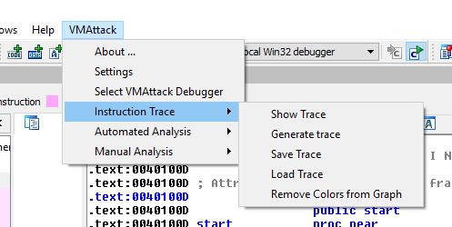

For the dynamic analysis capabilities of the plugin the use of an instruction trace is necessary. If you want to quickly check whether you already have a trace you can use the **Show Trace** feature. It will print your current trace in **IDA**s _output window_ or nothing if you don't have a trace.
But how can you actually get one? The two currently supported possibilities are to either generate an instruction trace or to load one from file:

- Trace generation requires a working **IDA** debugger(e.g. Win32 DBG or Bochs DBG) and uses the **IDA** debugger API to generate an instruction trace. Visited basic blocks and instructions are colored in a shade of blue (color can be removed afterwards via **Remove Colors from Graph**). During the execution function arguments are extracted, if not deactivated via **settings**.

- Alternatively an instruction trace can be loaded from file. Currently supported file types are .txt files exported from **IDA**s _Trace Window_ and .json files saved via **VMAttack**. OllyDbg and ImmunityDbg generated .txt trace files are supported but are currently more limited in the available analysis capabilities. 

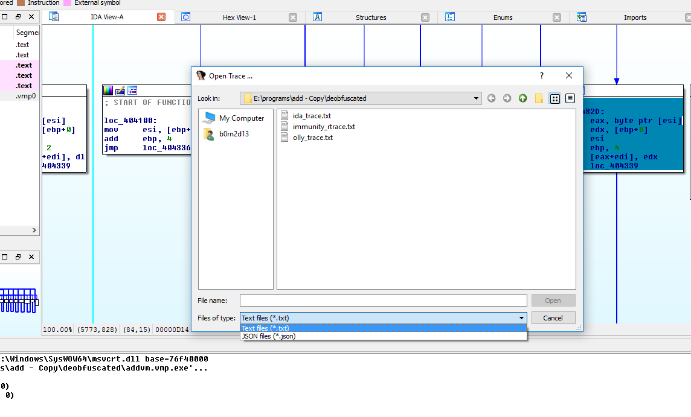

A reverse engineer can decide to save an analyzed trace as a .json file which can be loaded later on to continue analysis. This provides a convenient way to experiment on traces and combine different analysis together for improved results.

###What is actually a trace?

In the plugin context a trace is a list object of trace lines. Each trace line consists of four basic values:

- The thread id
- The address of the instruction
- The instruction
- The CPU Context **after** execution

additionally a trace line can contain:

- A stack comment
- A grade

These are explained later in their respective analysis sections. Each time a trace is presented in one of the plugins custom viewers, at least the four basic values will be available to ensure readability.

For more information see `dynamic/TraceRepresentation.py`

###Automated Analysis

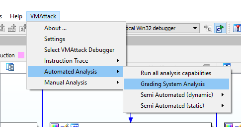

**Grading System**

The grading system analysis is a combination of all available analysis capabilities(static and dynamic) with additional pattern matching mechanisms. 
The basic principle is, that each trace line is initialized with a certain seed value, depending on the uniqueness of the trace line. This value is in turn upgraded or downgraded after each analysis run, depending on the importance an analysis assigns to this trace line. Additionally, after each analysis run a pattern matching upgrade or downgrade occurs for certain predefined patterns. This design results in high robustness, as the overall grade of a trace line consists of several analysis steps and one failing analysis will not necessarily lead to wrong results. Additionally a high level of automation can be achieved by countering the known weaknesses of certain analysis steps with pattern matching.
After a successful grading analysis attempt the user is presented with the result in the grading analysis viewer. The result consists of necessary trace information and the grade for each trace line.

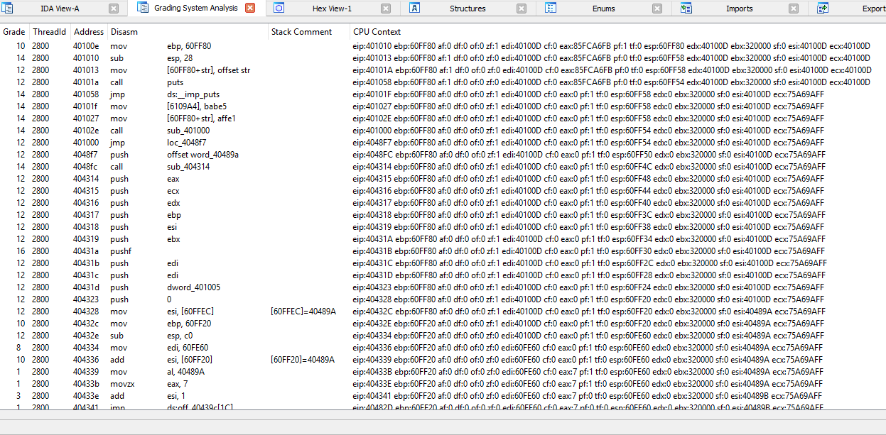

The grading analysis viewer provides additional interaction interfaces to the user and a custom context menu(**CCM**):

- Double clicking a grade declares it as threshold and will remove all lines with a lower grade

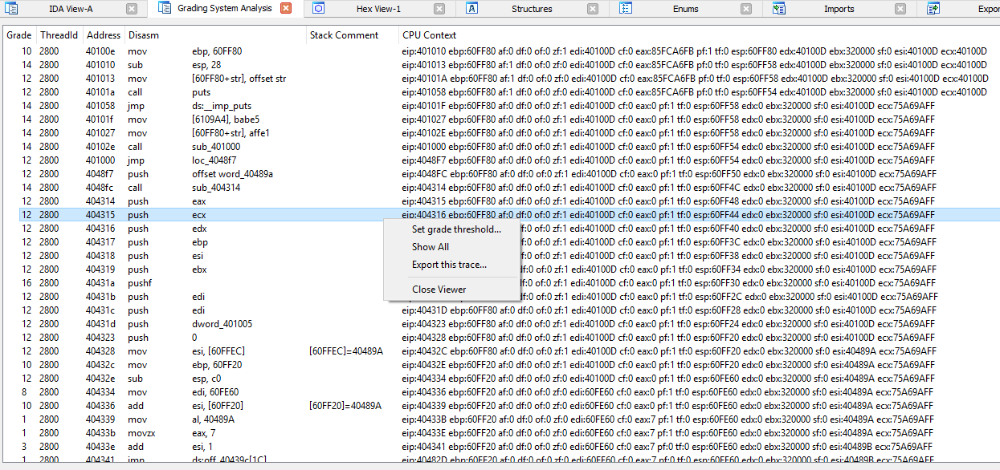

- **CCM** Set grades threshold...: only grades >= threshold will be displayed
- **CCM** Show All: display all trace lines 
- **CCM** Export this trace: save analysis result as .json file

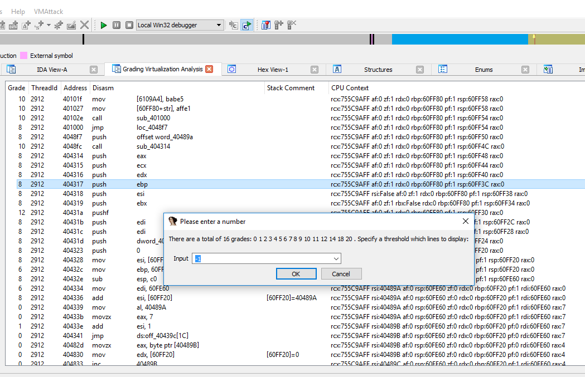

###Semi-Automatic Analysis
####Static Analysis

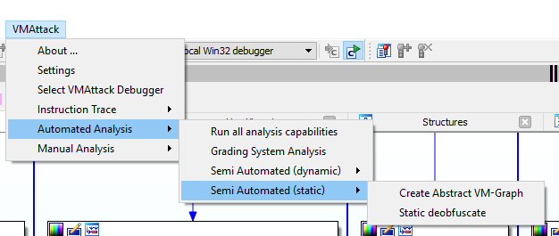

**Create Abstract VM Graph**

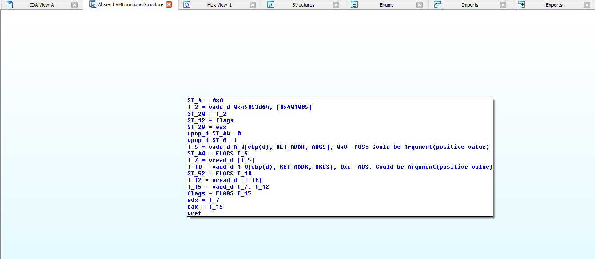

The abstract VM graph is an abstraction of how the control flow graph for the obfuscated function might look like. It is populated with instructions from the deobfuscated VM byte code and thus will require the previous execution of the static deobfuscate function. If static deobfuscate was not executed before it will be shortly before graph creation.

**Static deobfuscate**

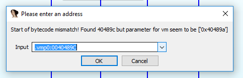

The static deobfuscate function tries to statically determine the instructions that will be executed by the byte code in the provided virtual machine function. The semi-automatic version of this analysis tries to determine all necessary values automatically. In the event of a mismatch the reverse engineer will be prompted for a decision. For example in this case the plugin determined the start of the bytecode to be at `0x40489c`, while the parameter for the function was `0x40489a`. This triggered a mismatch and the user is prompted with a decision which value should be used. In this case the function parameter `0x40489a` was indeed the start and should have been used as byte code start value.


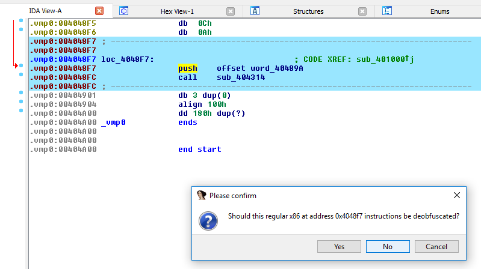

Another possibility where user interaction might become necessary, is when byte code is separated by useful executable instructions. In this example one could stop the deobfuscation at `0x4048f7` by choosing 'No' and input in the next prompt `Where should deobfuscation continue?` the address right after the instructions `0x404901`, as it is safe.

####Dynamic Analysis

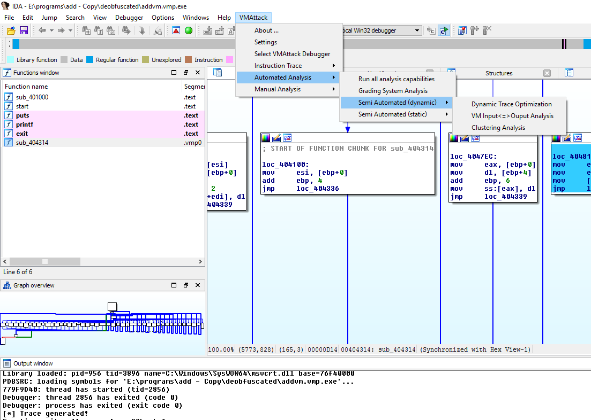

**Dynamic Trace Optimization**

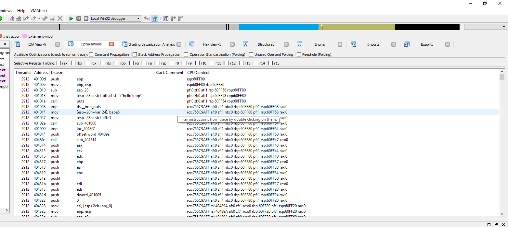

The trace optimizations viewer provides a way to dynamically interact with the trace. On one hand it allows the user to filter often occurring instructions or even remove whole register interactions from the trace, on the other it allows for powerful optimizations to be applied to the trace.

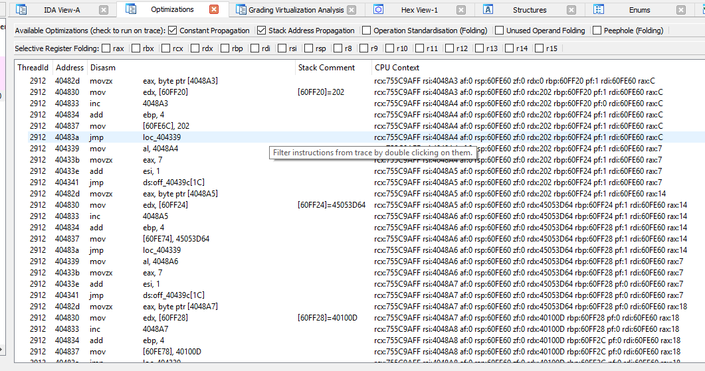
 
|:---:|:--- |
Constant Propagation | Constants are propagated where possible. This means registers are switched with their values and offsets which can be computed will be computed.
Stack Address Propagation | Every time a stack address is read the value on the stack address will be available as Stack comment.
Operation Standardisation (folding) | A weaker version of the peephole optimization which standardizes certain operations.
Unused Operand Folding (folding) | Operands that are not used in later execution steps are purged from the trace.
Peephole (folding) | The trace is traversed for specific patterns which are then replaced or deleted if deemed unnecessary.

Propagations should be always save to use, as they do not leave out anything. Foldings should be used with care, as they leave out lines deemed unuseful and as such might leave out too much.

These optimizations are a very important foundation of this plugin, as most other analysis functions use or even require one or more of these optimizations to be executed on the trace prior to their analysis.

For easier interaction with the trace the optimization viewer provides trace line removal by double click and a custom context menu(**CCM**):

- **CCM** Undo: Undo change
- **CCM** Restore original trace: restore the original trace
- **CCM** Open in Clustering analysis: send the current file to clustering analysis
- **CCM** Export this trace: save analysis result as .json file

To filter whole registers (e.g. eax) from the trace lines toggle the according check box by the register name.

**VM Input / Output Analysis**

The Input / Output Analysis provides essentially a black box analysis. For each register, starting at the output value of the virtual machine function a backtrack of how this value came to be will extract the relevant trace lines. If you are interested in a specific output value and want to know how this value came to be this is the goto function.
As an example lets assume we are interested in the value of the `eax` register. First the function will backtrack to which stack address the value in `eax` was mapped. Then the backtracking will continue, to determine, whether the value on the stack is a result of a calculation and if it is the backtracking will start recursively for the calculation values. Every trace line along the way which contains the result value or the components will be added to the registers input/output trace.

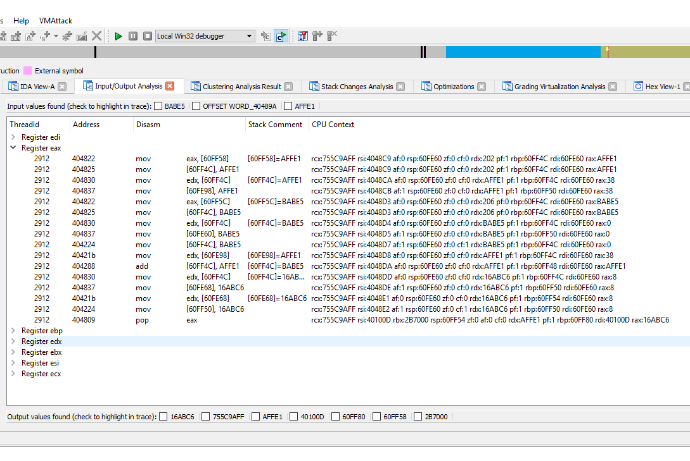

By checking the check boxes of the values the viewer adds colorization to them:

- Yellow: input values
- Red: output values
- Green: both

If a register turns green it is an indication, that its trace lines contain both a input and an output parameter. This means the register handles both the selected input and output values and either computations take place or the values are part of the trace lines CPU context.

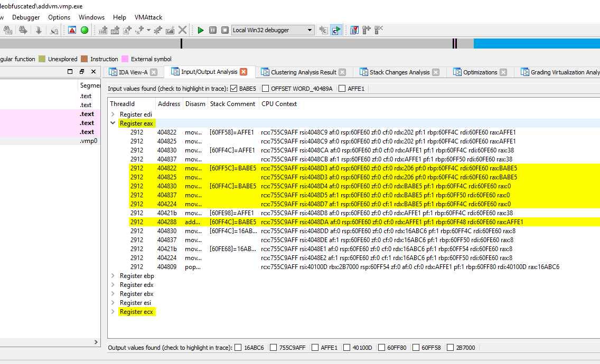

**Clustering Analysis**

The main goal of the clustering analysis is to divide the instruction trace into clusters(=repeating instructions) and singles(=non-repeating instructions). The default declares a cluster if an address is encountered more than two times however this can be changed via **settings** by changing the value for `cluster heuristic`. After successful analysis the reverse engineer is presented with an instruction trace with single instructions and clusters. If basic block detection was not deactivated, the clusters themselves are additionally subdivided into basic blocks. Each basic block is shown as a one line summary. The basic block description consists of the basic block position inside the cluster, the start and end addresses and an instruction and stack change summary. While the stack change summary will contain all stack changes which took place during this basic block, instructions are only shown, if their value is used later or it is unclear whether their value is used. Instructions whose computations are simply overridden are not displayed in the basic block summary. 

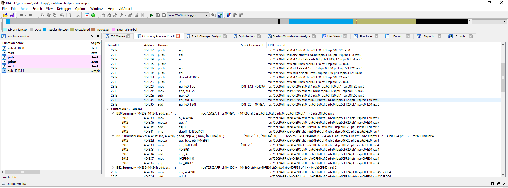

The stack changes viewer presents the stack and shows the changes which took place during the execution. It will be opened as part of the clustering analysis along with the clustering viewer. Aside from the stack address view, the user can also see which stack addresses are mapped onto which cpu registers. Basically this provides a stack centered point of view on the execution which is especially useful for stack machine based virtual machines, which operate mainly over the stack. 

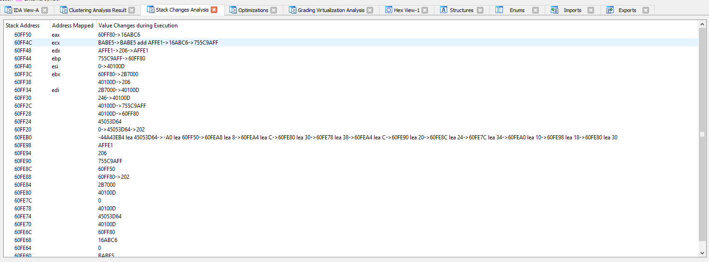

###Manual Analysis
####VM Context

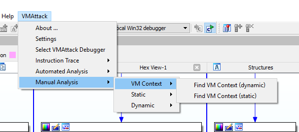

The VM Context consists of four values:

- Code Start - the byte code start
- Base Addr - the base address of the jump table
- Code End - the byte code end
- VM Addr - the start address of the virtual machine function 

The user has the choice whether he wants to determine it statically or dynamically. An alternative to this is to manually input the values during static analysis or in the **settings** menu.

####Static Analysis

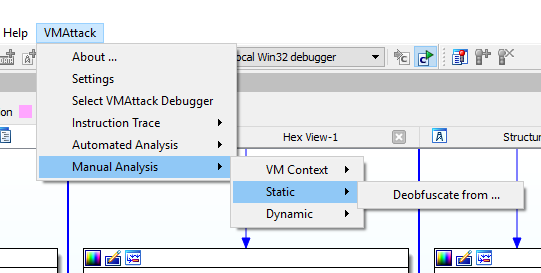

**Deobfuscate from...**

This provides a manual interface for the static deobfuscation function. Static deobfuscation requires four input values which are basically the VM context. This is useful if static and/or dynamic determination of the VM context fail but the reverse engineer managed to retrieve the right values.
Upon selection the user will be prompted for all the values:

- Code Start - the byte code start
- Base Addr - the base address of the jump table
- Code End - the byte code end
- VM Addr - the start address of the virtual machine function

####Dynamic Analysis

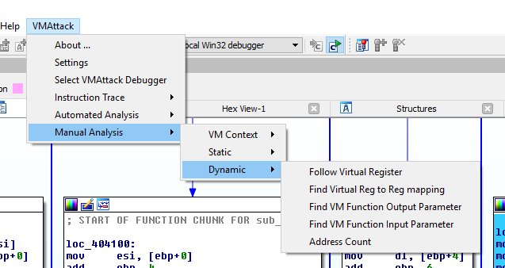

**Follow Virtual Register:** This provides a manual interface to the register tracking functionality. 
    
**Find Virtual Reg to Reg mapping:** This function helps to map the stack addresses of the output from the virtual machine function to the registers in which those values are returned.
    
**Find VM Function Output Parameter** Finds function output parameter.
    
**Find VM Function Input Parameter** Finds function input parameter.

**Address Count:** The address count reads in a trace and returns in **IDA**s output window the ratio: (Address : frequency of occurrence). The Disasm is also displayed.

###Settings

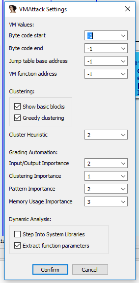

The Settings provide the necessary interface to enable the user to change values on the fly or even input own values if the ones determined by the plugin are wrong. Further changes in the default behaviour of the program can also be selected or deselected.  

|:---- |:---- |
Code Start | the byte code start
Base Addr | the base address of the jump table
Code End | the byte code end
VM Addr | the start address of the virtual machine function
Show Basic Blocks | show basic blocks during clustering analysis
Greedy Clustering | cluster until no more clusters are found
Cluster Heuristic | after how many repetitions an address becomes a cluster
Input/Output Importance | Importance of input/output analysis for the grading system (set to 0 to disable)
Clustering Importance | Importance of clustering analysis for the grading system (set to 0 to disable)
Pattern Matching Importance | Importance of pattern matching analysis for the grading system (set to 0 to disable)
Memory usage Importance | Importance of memory instructions analysis for the grading system (set to 0 to disable)
Step Into System Libraries | Should system libraries be disregarded during trace generation
Extract function parameters | Should function parameters be extracted during trace generation

##Quick start guide

The Example folder contains the obfuscated and source files for an add function. The **addvmp** contains the vmfunction which we will analyze now.

First thing after loading the example file **addvmp** into **IDA** should be the acquisition of an instruction trace. You can either load a trace from file or generate one. Trace generation is automatic and upon completion it will produce a success notification in **IDA**s _Output window_. Traversed paths will be colored in a shade of blue, where a darker shade represents a higher number of traversals. Alternatively the loaded trace will only produce the success notification.
With the newly generated/loaded trace we now have dynamic an static capabilities enabled and can start the _grading system analysis_. Starting with the _grading analysis_ is usually a good fit, since it is automated and takes several analysis capabilities into account. This enables a **cumulative** result which can even tolerate analysis errors to some extent and still produce good results. At the end of the grading analysis the now graded trace will be presented in the **grading viewer**. The trace can now be filtered either by double clicking a grade or via context menu where the user will be prompted to input the grade threshold to display.
In the case of addvmp it will be enough to select the highest grade to be presented with obfuscated function (since the obfuscated function is quite simple in this case). Additionally, should the result be not satisfiable, the user can change the importance of an analysis function (**see settings**) or even disable them (by setting the importance to 0), to produce better results. 

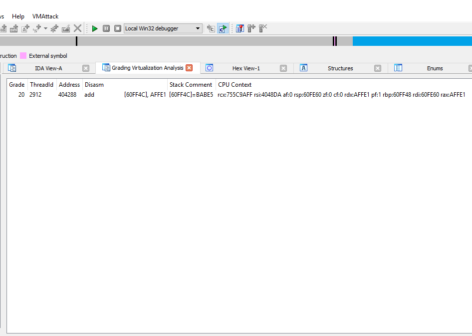

Lets assume we have a more complicated function and the _grading analysis_ did not lead us to the relevant instructions.
One of the _semi-automated analysis_ capabilities could present a viable alternative or even show us which analysis function failed the grading system.
The _input/output analysis_ could provide leads as to how the input arguments of the VM function are used and whether there is a connection between function input and function output. By checking the two input values `AFFE1` and `BABE5` and additionally the output value `16ABC6` it becomes evident which register contains the important instructions for out obfuscated function and how the `eax` return value came to be `16ABC6`.

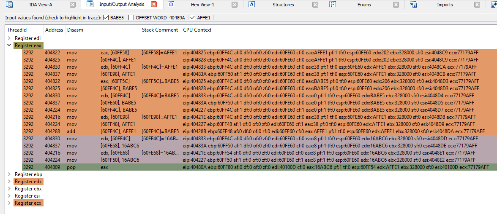

Another powerful functionality is the _clustering analysis_. It enables the reverse engineer to quickly discern between repeating instructions and unique ones. The _clustering analysis view_ additionally enables quick removal of unnecessary clusters (or instructions) in a way speeding up the work of the reverse engineer. Should a mistake be made it can be undone or alternatively the original trace can be restored. To make sense of the clustering analysis usually requires an extensive analysis of the trace and can require repeating the clustering analysis with a different cluster heuristic value set via **settings**.

Out of the semi-automatic analysis the _optimization analysis_ requires the most user interaction. In turn it enables:

- Optimizations which make the trace easier to read or even filter as unnecessary recognized instructions. 
- Filtering capabilities to remove as unnecessary recognized instructions or even whole registers from the trace.
- Undoing actions if you made a mistake.
- Restoring the initial trace if you hit a wall.

The _static analysis_ in this case would enable us to analyze the byte code and optionally view the analysis as an _abstract VM graph_ of the byte code. The static deobfuscation of the byte code will produce comments behind relevant bytes to describe the operation this byte produces. The commented instructions are quite intuitive and should be easy to read.
The abstract VM graph in turn will produce a control flow graph (in the case of addvmp just one basic block) filled with those abstract instructions from the byte code. This is also a good example of the accuracy of the static analysis, which without execution delivered an accurate representation of the initial deobfuscated function. After the static analysis we can clearly see that two arguments were passed to the function _(AOS = acces out of known space; indicates for example arguments passed via stack)_ and that they were eventually added together and then returned.

